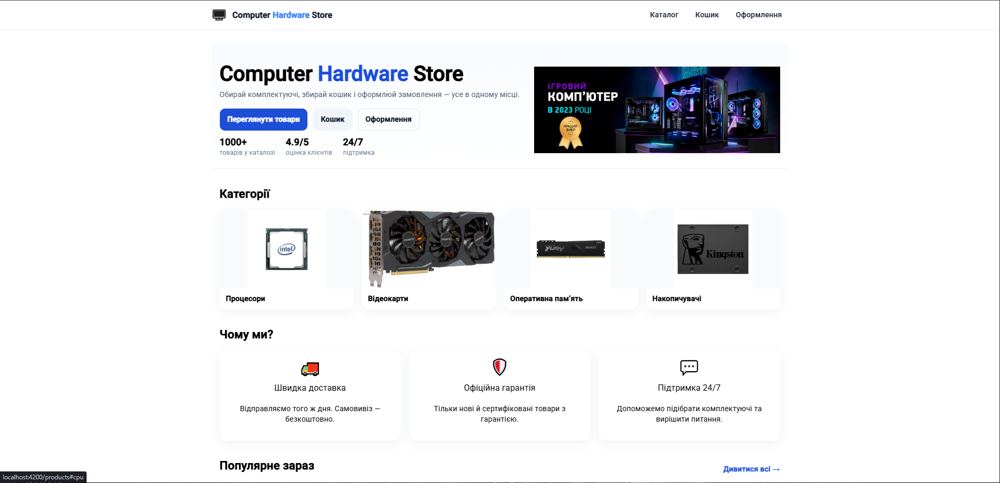
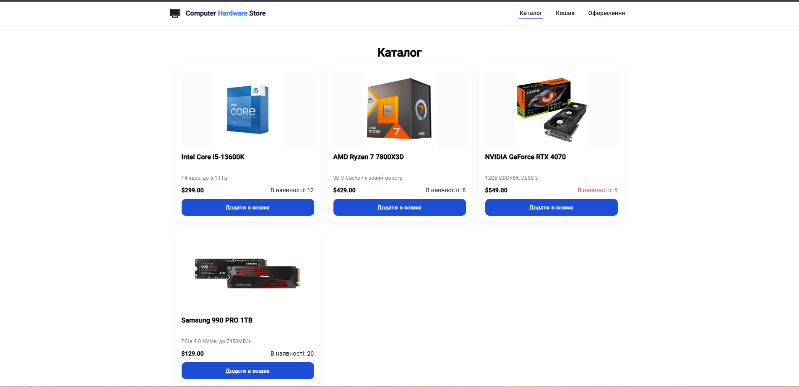
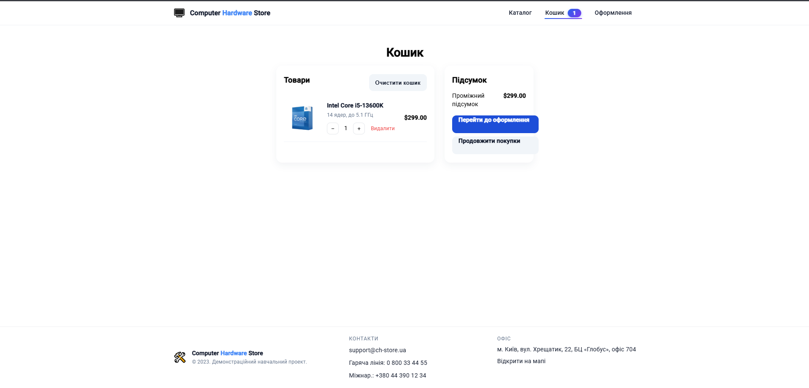
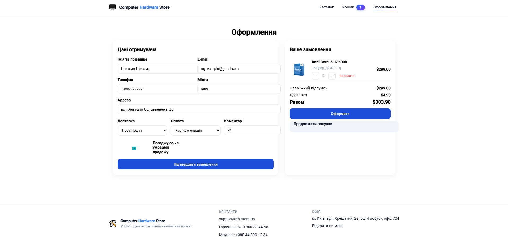

# Computer Hardware Store (Angular)

Веб-додаток інтернет-магазину комп’ютерної техніки на **Angular**.  
Каталог товарів, кошик, сторінка оформлення замовлення, детальні сторінки товарів, адаптивний дизайн.

---

## Функціональність
-  **Каталог**: список товарів із ціною, наявністю, картинкою.
-  **Детальна сторінка товару**: опис, ціна, кнопка додавання до кошика.
-  **Кошик**: перегляд позицій, зміна кількості, видалення, підсумок.
-  **Checkout**: форма даних отримувача, способи доставки/оплати, валідація, підтвердження.
-  **Навігація**: хедер/футер, breadcrumbs (крихти) на деталці.
- 🖼 **Оптимізація зображень**: assets, коректні пропорції, без мерехтіння.
-  **Адаптивність**: коректне відображення на мобільних/планшетах/десктопах.

---

##  Скріншоти

###  Головна сторінка


###  Каталог


###  Кошик


### Оформлення замовлення


---

## Технології
- **Angular** 17+ (Standalone Components, Signals)
- **TypeScript**
- **Angular Router**
- **Reactive Forms**
- **SCSS/CSS**, утилітарні класи
- **ESLint + Prettier** (за потреби)

---

### Вимоги
- Node.js 18+  
- npm 9+  
- Angular CLI :  
  ```bash
  npm i -g @angular/cli
